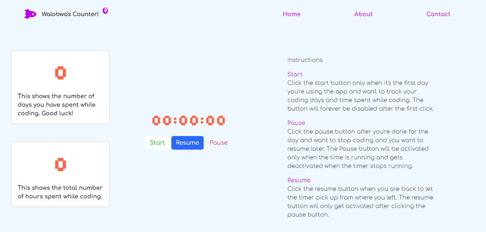

<h1 align= "center">100-Days Of Code Counter</h1>

This short app assists you in counting the amount of time you spend on your screen while coding ...

Created while learning the basics of JavaScript and using bootstrap as a CSS library. Made friendly UI for all. 

<h3>Languages and tools:</h3>
